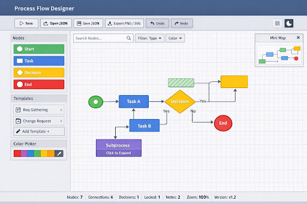

# 🎨 Process Flow Designer

A powerful, fully client-side visual workflow designer built with vanilla JavaScript. Create professional process flow diagrams with an intuitive drag-and-drop interface.

## 🚀 [Live Demo](https://YOUR_USERNAME.github.io/ProcessFlowDesigner/)



---

## ✨ Features

### Core Functionality
- 🎯 **4 Node Types:** Start (green), Task (blue), Decision (yellow), End (red)
- 🖱️ **Drag & Drop:** Intuitive node placement from palette
- 🔗 **Connection Tool:** Click-to-connect workflow linking
- ✏️ **Inline Editing:** Double-click nodes to edit labels
- 🔍 **Zoom & Pan:** Smooth canvas navigation

### Phase 2 Features (NEW!)
- ↶ **Undo/Redo:** 50-step history with Ctrl+Z/Ctrl+Y
- ☑️ **Multi-Select:** Shift+Click or drag-to-select multiple nodes
- 🖼️ **PNG Export:** High-quality image export for presentations
- 📄 **JSON/SVG Export:** Save and share workflows
- 💾 **Auto-Save:** LocalStorage persistence (every 5 seconds)

---

## 🎮 Quick Start

1. **Visit the [Live Demo](https://YOUR_USERNAME.github.io/ProcessFlowDesigner/)**
2. **Drag nodes** from the left palette onto the canvas
3. **Click "Connect"** button, then click two nodes to link them
4. **Double-click** nodes to edit labels
5. **Export** your workflow as PNG or JSON

---

## ⌨️ Keyboard Shortcuts

| Shortcut | Action |
|----------|--------|
| `Ctrl+Z` | Undo |
| `Ctrl+Y` | Redo |
| `Ctrl+A` | Select all nodes |
| `Ctrl+S` | Save workflow |
| `Delete` | Delete selected items |
| `+` / `-` | Zoom in/out |
| `Space + Drag` | Pan canvas |
| `Shift+Click` | Multi-select nodes |
| `Escape` | Clear selection |

---

## 🛠️ Technology Stack

- **Vanilla JavaScript (ES6+)** - No frameworks
- **SVG** - Scalable vector graphics
- **interact.js** - Drag and drop
- **html2canvas** - PNG export
- **LocalStorage** - Client-side persistence

**Total size:** ~3,500 lines of code, zero backend required!

---

## 📦 Installation (Local Development)

```bash
# Clone repository
git clone https://github.com/YOUR_USERNAME/ProcessFlowDesigner.git
cd ProcessFlowDesigner

# Start local server (required for ES6 modules)
python -m http.server 8000

# Open browser
http://localhost:8000
```

**Note:** A web server is required for local development due to ES6 module CORS restrictions. GitHub Pages serves files over HTTPS automatically.

---

## 📊 Project Structure

```
ProcessFlowDesigner/
├── index.html              # Main entry point
├── css/                    # Stylesheets (8 files)
├── js/
│   ├── app.js             # Application bootstrap
│   ├── config.js          # Configuration
│   ├── modules/           # Core modules (11 files)
│   │   ├── stateManager.js
│   │   ├── eventBus.js
│   │   ├── canvas.js
│   │   ├── nodes.js
│   │   ├── connections.js
│   │   ├── undoRedo.js
│   │   └── ...
│   └── utils/             # Utilities (4 files)
└── assets/
    └── templates/         # Sample workflows
```

---

## 🎯 Use Cases

- 📋 **Business Process Modeling**
- 🔄 **Workflow Documentation**
- 🎓 **Educational Diagrams**
- 💼 **Project Planning**
- 🤖 **Algorithm Flowcharts**
- 📊 **Decision Trees**

---

## 🌟 Roadmap

### Phase 1 (Complete ✅)
- Basic node creation and connections
- Zoom/pan canvas
- JSON export/import
- Auto-save

### Phase 2 (In Progress 🚧)
- ✅ Undo/Redo
- ✅ Multi-select
- ✅ PNG/SVG export
- 🔄 Curved connections
- 🔄 Connection labels
- 🔄 Mini-map

### Phase 3 (Planned 📅)
- Auto-layout algorithm
- Dark mode theme
- Node grouping
- Collaboration features

---

## 🤝 Contributing

Contributions are welcome! This is an open-source project.

1. Fork the repository
2. Create your feature branch (`git checkout -b feature/AmazingFeature`)
3. Commit your changes (`git commit -m 'Add some AmazingFeature'`)
4. Push to the branch (`git push origin feature/AmazingFeature`)
5. Open a Pull Request

---

## 📄 License

This project is open source and available under the MIT License.

---

## 🙏 Acknowledgments

- **interact.js** - Excellent drag and drop library
- **html2canvas** - PNG export functionality
- Inspired by Lucidchart, Draw.io, and other flowchart tools

---

## 📧 Contact

- **Issues:** [GitHub Issues](https://github.com/YOUR_USERNAME/ProcessFlowDesigner/issues)
- **Discussions:** [GitHub Discussions](https://github.com/YOUR_USERNAME/ProcessFlowDesigner/discussions)

---

## 📸 Screenshots

### Creating Workflows


### Multi-Select


### Export Options


---

**⭐ If you find this useful, please star the repository!**

Built with ❤️ using vanilla JavaScript - No frameworks, no build tools, just clean modern web development.
